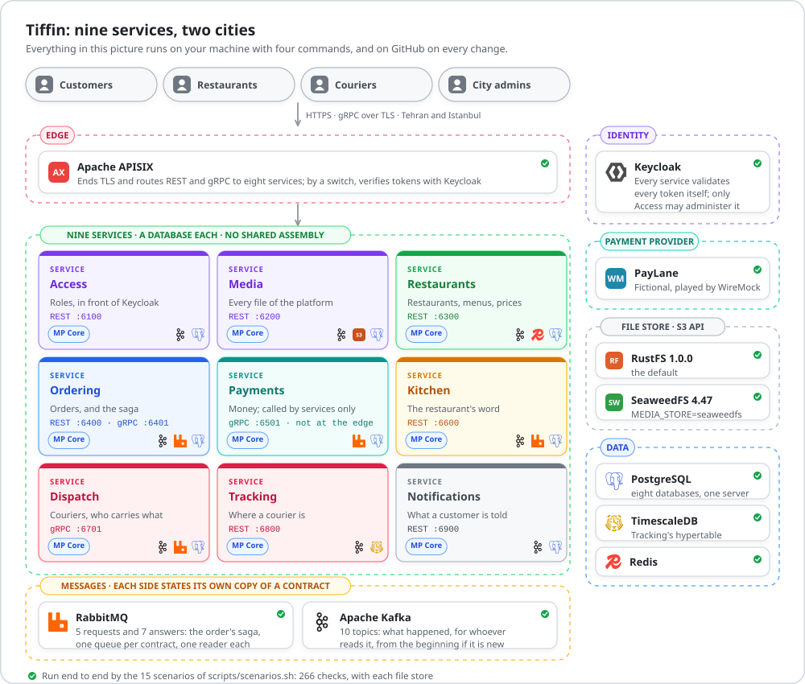
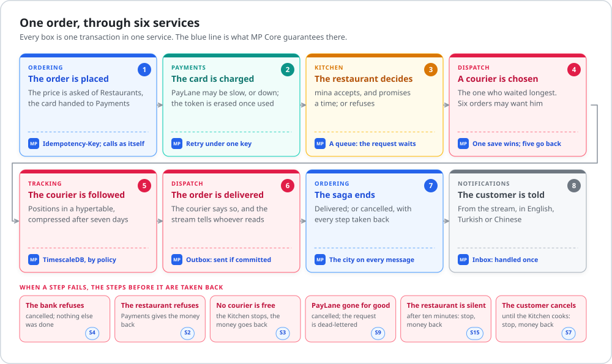
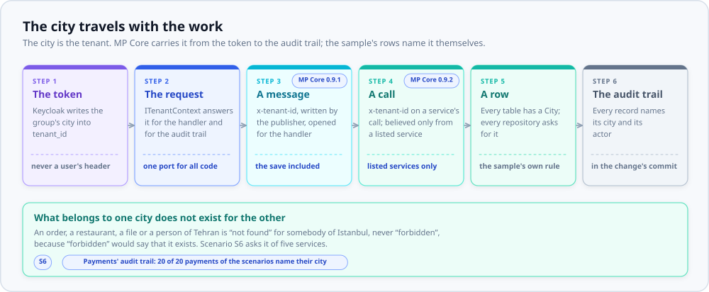
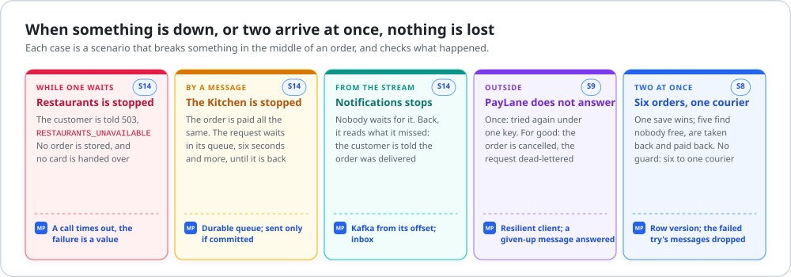
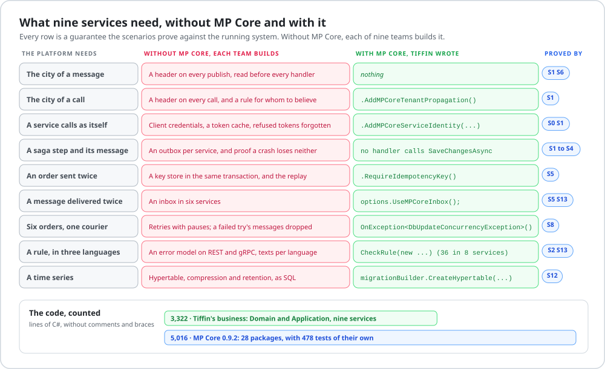

<div align="center">

# Tiffin

**The MP Core microservices sample: food delivery in nine services, none of which trusts another to be up.**

Nine services built with [MP Core](https://github.com/panahister/mpcore), each with a database of its own,<br>
two cities that never see each other, and fifteen scenarios that prove what is claimed here.

[](https://github.com/panahister/mpcore-tiffin-sample/actions/workflows/ci.yml)
[](https://github.com/panahister/mpcore)
[](LICENSE)
[](global.json)

[Run it](#run-it) ·
[One order](#one-order-through-six-services) ·
[Why MP Core](#why-mp-core-in-this-platform) ·
[Architecture](docs/architecture.md) ·
[The business](docs/business.md) ·
[What MP Core does here](docs/mpcore-coverage.md) ·
[Variations](docs/variations.md) ·
[What building it found](docs/findings.md)

</div>

<picture>
  <source media="(prefers-color-scheme: dark)" srcset="docs/images/system-dark.svg">
  
</picture>

> **State: work in progress.** Everything on this page was run; the section [What is not here yet](#what-is-not-here-yet)
> says what was not. Tiffin is built with MP Core `0.9.2` from nuget.org.

A tiffin is the lunch box that the dabbawalas of Mumbai carry from a kitchen to a desk, some two hundred
thousand a day, by hand and by train, with next to no box lost. This sample is about the same thing:
something that passes through many hands and arrives.

## What it shows

[Storefront](https://github.com/panahister/mpcore-storefront-sample), the other sample, is a modular
monolith and two services. Tiffin is what comes after: **every bounded context is a service**, and
everything that makes that hard is here, in code that runs.

| The question | What Tiffin does | Proved by |
|---|---|---|
| Four services change their data for one order. What keeps them consistent? | An orchestration-based saga: Ordering knows the next step, and how each step that was taken is taken back | S1 to S4, S7 |
| Two orders reach for the last courier at the same moment | Optimistic concurrency: one save wins, the other is tried again and finds nobody | S8, and an experiment without the guard: one courier was given six orders |
| A request arrives twice | `Idempotency-Key` on the request, an inbox on every consumer | S5 |
| Two cities share the platform | The city is the tenant: in the token, in every message, in every row, in the audit trail | S6 |
| A service calls another | As itself, with a token of its own (OAuth 2.0 client credentials), over a client that times out and retries | S0, S1 |
| A service is down | Who asks it while a customer waits is told to try again, and nothing is stored. A message for it waits in its queue. A reader of the stream reads what it missed | S14: three services stopped in the middle of an order |
| The payment provider is down | The client tries again under one key; when it is given up the order is told, and the request waits in the dead-letter queue | S9 |
| Who may change roles, and where are they kept? | One service, Access, in front of the identity provider: an anti-corruption layer. No other service may call Keycloak's administration | S0, S10 |
| Where do files live? | One service, Media, is the single source of truth. The bytes never pass through a service: they go to a store that speaks the S3 API | S11, run with two stores |
| A time series | Positions of couriers in a TimescaleDB hypertable, compressed and expired by policy | S12 |
| A new reader of events | Notifications was added last, reads the stream from its beginning, and no other service was changed | S13 |
| The customer's language | Every failure and every notification in English, Persian or Turkish, by `Accept-Language` | S2, S6, S11, S13 |

## The services

| Service | What it owns | Transport | Messaging | Storage |
|---|---|---|---|---|
| `access/` | Decisions about roles; the only client of Keycloak's administration | REST `6100` | Kafka | PostgreSQL |
| `media/` | Every file of the platform | REST `6200` | Kafka | PostgreSQL, an S3 store |
| `restaurants/` | Restaurants, menus, prices | REST `6300` | Kafka | PostgreSQL, Redis |
| `ordering/` | Orders, and the process that moves them | REST `6400`, gRPC `6401` | RabbitMQ and Kafka | PostgreSQL |
| `payments/` | The money of an order; called by services only | gRPC `6501` | RabbitMQ | PostgreSQL |
| `kitchen/` | The restaurant's word on an order | REST `6600` | RabbitMQ and Kafka | PostgreSQL |
| `dispatch/` | Couriers, and who carries what | gRPC `6701` | RabbitMQ and Kafka | PostgreSQL |
| `tracking/` | Where a courier is | REST `6800` | Kafka | TimescaleDB |
| `notifications/` | What a customer is told | REST `6900` | Kafka | PostgreSQL |

In front of them stands Apache APISIX; beside them Keycloak, and PayLane, a payment provider that is
fictional and played by WireMock. Every service was generated by `mpcore new backend` and then given its
business: [docs/architecture.md](docs/architecture.md) says what the generator wrote and what was added.

**The services share no assembly.** A service is a solution of its own and builds alone. What two of them
agree on is a message or a contract file, stated by each in its own code, and one test project holds the
copies together: [tests/Tiffin.Contracts.Tests](tests/Tiffin.Contracts.Tests).

## One order, through six services

<picture>
  <source media="(prefers-color-scheme: dark)" srcset="docs/images/order-journey-dark.svg">
  
</picture>

The customer is told "accepted" (HTTP 202) the moment the order has an identity; whether the card has the
money, the restaurant will cook and a courier is free is answered afterwards, by the service that knows.
Ordering is the only one that knows the whole: an *orchestration-based saga* (Hector Garcia-Molina and
Kenneth Salem, 1987; Chris Richardson, 2018). Requests and answers travel on RabbitMQ, one queue per
contract and one reader each; what happened is written to Kafka, for whoever wants to read it
([docs/architecture.md](docs/architecture.md)).

## The city travels with the work

<picture>
  <source media="(prefers-color-scheme: dark)" srcset="docs/images/city-dark.svg">
  
</picture>

Two cities share one platform, and neither can see the other. The city is written into the token by
Keycloak, and from there MP Core carries it: into the header of every message (`0.9.1`) and of every call
one service makes to another as itself (`0.9.2`), and into every record of the audit trail. Tiffin found
both gaps by running, and both were closed in MP Core, not worked around here
([docs/findings.md](docs/findings.md), T-01 and T-05).

## When something is down

<picture>
  <source media="(prefers-color-scheme: dark)" srcset="docs/images/failure-dark.svg">
  
</picture>

Scenario S14 stops Restaurants, the Kitchen and Notifications in the middle of an order, and checks that the
customer is told, that a request waits in its queue for six seconds and more, and that a reader of the
stream catches up. Every case in the picture is a scenario of `scripts/scenarios.sh`.

## Why MP Core, in this platform

<picture>
  <source media="(prefers-color-scheme: dark)" srcset="docs/images/why-mpcore-dark.svg">
  
</picture>

Nine services need the same guarantees nine times: the city on every message and every call, a token of
their own, a step of the saga and its message in one commit, an order sent twice, a message delivered
twice, a race for the last courier, a rule answered in the customer's language. Without a framework, each
team builds them, and proves them again. In Tiffin each of those is one line, or nothing at all, and the
scenario in the last column proves it against the running system.

**How the code was counted.** Lines of C# that are neither blank, nor comments, nor a brace alone;
migrations, `bin` and `obj` left out. Tiffin: the `Domain` and `Application` projects of the nine services.
MP Core: the `src` of its 28 runtime packages at `0.9.2`; its tests are another 6,876 lines, 478 tests, run
against PostgreSQL, TimescaleDB and Redis. The hosts and adapters of Tiffin are another 4,986 lines.

## Run it

You need the .NET SDK `10.0.400`, Docker with 10 GB of memory, `jq`, `curl` and `grpcurl`. On a Mac with
Apple Silicon also `brew install protobuf grpc`, or Rosetta.

Tiffin uses MP Core `0.9.2`, from nuget.org. A clone of MP Core next to this repository is optional: when
it is there, the build uses its source instead ([docs/running.md](docs/running.md)).

```bash
git clone https://github.com/panahister/mpcore-tiffin-sample.git
```

```bash
cd mpcore-tiffin-sample && scripts/up.sh && scripts/setup.sh
```

```bash
scripts/run.sh all
```

```bash
scripts/scenarios.sh
```

`scripts/up.sh` starts what the services depend on, in Docker. `scripts/setup.sh` writes their addresses
into each service's user secrets, outside the repository. `scripts/run.sh all` builds the nine services
and runs them on this machine, where they can be debugged. `scripts/scenarios.sh` tells fifteen stories
through real calls with real tokens, and fails if one of them does not end as it should.
[docs/running.md](docs/running.md) has the rest: one service alone, the logs, the second store, the tests.

## What was run, and what it said

On 2026-09-28, on a Mac with Apple Silicon, against MP Core's source:

| What | Result |
|---|---|
| Unit tests of the nine services | 170 passed |
| Contract tests between them | 43 passed |
| The fifteen scenarios, on databases that were made anew, with RustFS as the store | 266 checks passed, none failed, none skipped |
| Scenario S11, the one that uses the store, with SeaweedFS | 33 checks passed |
| Build | Release, warnings as errors: no warning |

The same day, against MP Core from nuget.org with an empty package cache, first `0.9.1` and then `0.9.2`: the 213 tests passed each time.

And on GitHub, on Linux, on every change ([the workflow](.github/workflows/ci.yml)), first on 2026-09-28
(run [36390966923](https://github.com/panahister/mpcore-tiffin-sample/actions/runs/36390966923)):

| What | Result |
|---|---|
| Build, unit and contract tests | Release, warnings as errors: 213 passed |
| The fifteen scenarios with RustFS, the edge not verifying tokens | 266 checks passed, none failed, none skipped |
| The fifteen scenarios with SeaweedFS, the edge verifying tokens with Keycloak | 266 checks passed, none failed, none skipped |

The first run on GitHub failed twelve checks of S14, with both stores. The defect was in the workflow,
not in a service: [docs/findings.md](docs/findings.md), T-13.

A check that passes the first time proves little. For the tests and scenarios that guard a guarantee, the
code was broken on purpose and the check was seen to fail: [docs/findings.md](docs/findings.md) lists each.

## What is not here yet

| Not here | Why it matters | State |
|---|---|---|
| Two instances of one service | what shows that the inbox, the cache and the queues are shared | not run |
| Two versions of one event side by side | how a contract changes without stopping its readers | not written |
| A step that waits too long | an order waits for ever for a restaurant that never answers | not written: MP Core's publisher cannot delay a message ([findings](docs/findings.md), T-08) |
| Kubernetes | | fits by standard, not run |
| Ceph, Amazon S3 as the store of Media | | fit by standard, not run. RustFS and SeaweedFS were run |
| Traces across the nine services | | the exporters are configured and off; not looked at |
| Skills for AI agents at the root | a task given at the root finds the service it belongs to, as in Storefront | not written; each service carries MP Core's ten |

## Licence

[Apache-2.0](LICENSE) and [NOTICE](NOTICE). Tiffin, PayLane and the people named in the scenarios are
fictional. The names and marks of the products in the pictures belong to their owners and are used only to
name those products. The pictures are drawn by `scripts/diagrams/tiffin.py` with the kit Storefront draws its
own with.
