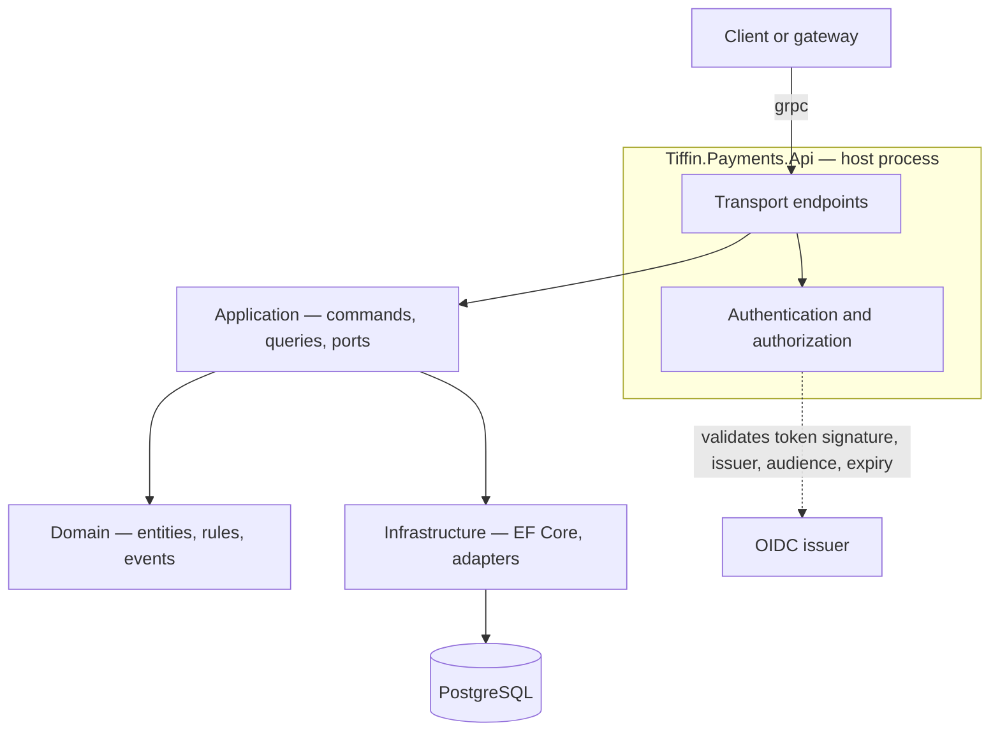
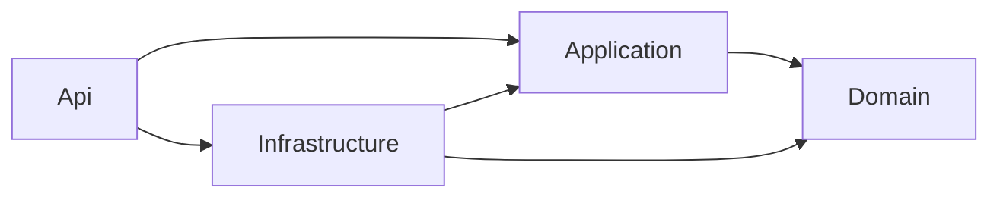
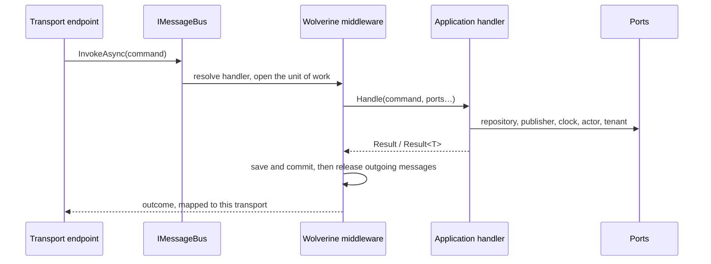
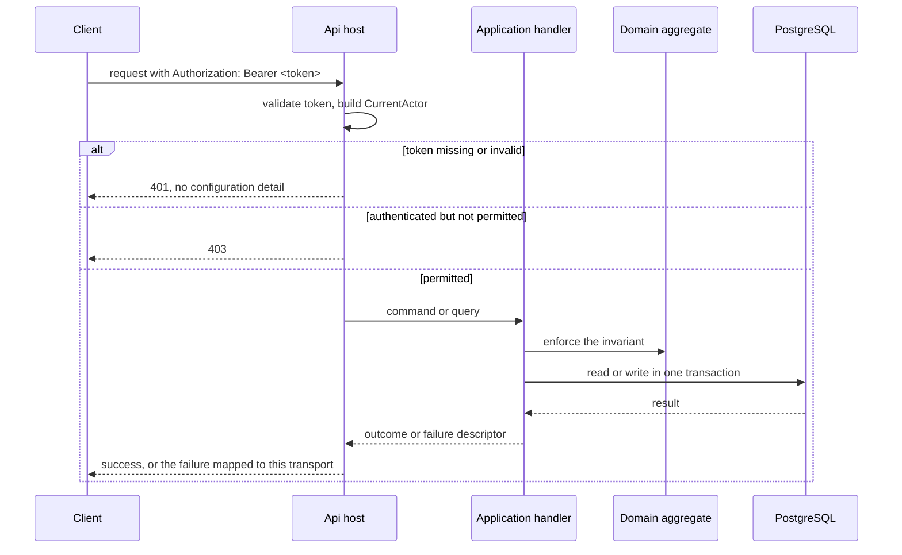
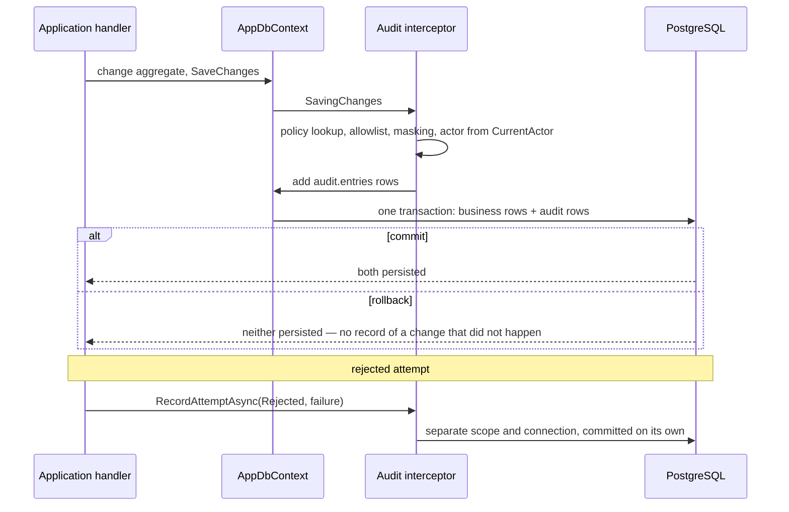
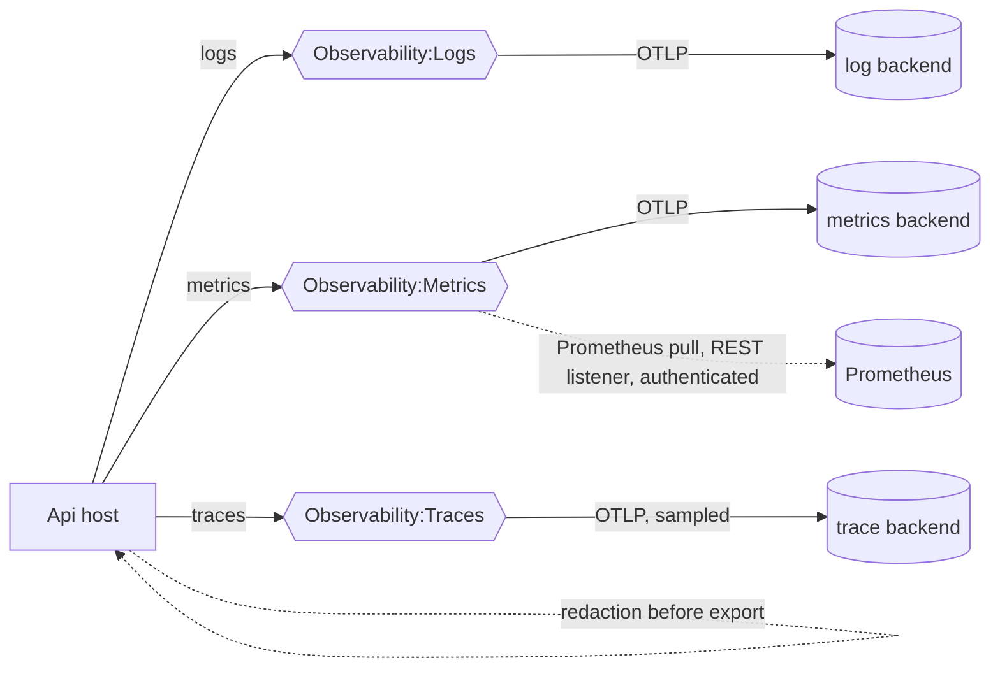
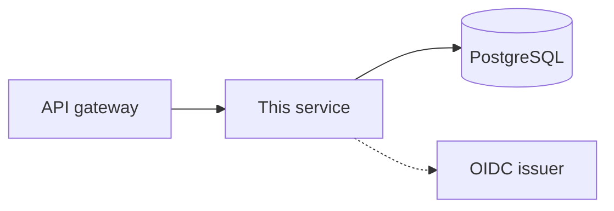

# Architecture of Tiffin.Payments

This describes **this** repository as it was generated, not everything MP Core can do. For the full
framework catalogue and what is deliberately absent, read [capabilities.md](capabilities.md).

| | |
|---|---|
| Shape | `service` |
| Transport | `grpc` |
| Messaging | `rabbitmq` |
| AI tooling | `both` |
| MP Core | `0.9.0` |

The source of truth is `.mpcore/template-manifest.json`. If this document and that file disagree, the
manifest is right and this document is stale.

## Scope

A working technical foundation with **no business behaviour**. Host, transport, persistence,
security and observability are wired; your domain is not, and no module is invented for you.

## Components

Solid arrows are runtime calls. The dotted arrow is metadata retrieval and token validation, not a
per-request round trip. External systems are drawn only when this project actually talks to them.

## Layers and dependency direction

These arrows are **compile-time dependencies**, and they point inward only.

| Project | Responsibility | May depend on |
|---|---|---|
| `Domain` | Entities, value objects, business rules, domain events | `MPCore.Domain` only |
| `Application` | Commands, queries, handlers, validators, ports; returns failures rather than throwing for expected outcomes | Domain, `MPCore.Application`, and the abstraction packages `MPCore.Persistence.Abstractions`, `MPCore.Messaging.Abstractions`, `MPCore.Security.Abstractions`, `MPCore.Tenancy.Abstractions` |
| `Infrastructure` | EF Core mapping, repositories, external clients | Domain, Application, provider packages |
| `Api` | Host composition, transport endpoints, authentication wiring | all of the above |

This repository is one bounded context, so the three layers are three projects: the compiler enforces
the direction between them. The Application project uses the folders a module of a modular monolith
uses: `Commands/`, `Queries/`, `Views/`, `Ports/`, `Process/` and `Validators/`, one use case per file.
[The module guide](https://github.com/panahister/mpcore/blob/main/tools/MPCore.Templates/content/Tiffin.Payments/src/Modules/README.md)
in MP Core's repository explains each of them and names its source.

If a Domain type needs `DbContext`, ASP.NET or a broker, the model is wrong — that is the signal, not
a reason to add the reference.

## Business rules, validation and messages

Three kinds of check, each in one place:

| Check | Example | Where | How |
|---|---|---|---|
| Input shape | a required field, a length, a phone format | before the handler | a FluentValidation validator in `Validators/`, run by `UseMPCoreFluentValidation()` |
| Business rule | a shipped order cannot be cancelled | inside the aggregate | a `BusinessRule` checked with `CheckRule(...)` |
| Authorization | only a catalog manager changes a price | at the endpoint and in the handler | policies and `ICurrentActorAccessor` |

- **A query only reads.** It declares no `IUnitOfWork` and reads through a read-model port; it is the only
  thing an HTTP `GET` sends, because `GET` must be safe (RFC 9110).
- **A validator never reads the database.** A check that needs state is a business rule. A failed
  validator reaches the caller as a `400` (gRPC `InvalidArgument`) with one violation per field.
- **A broken business rule** throws `BusinessRuleValidationException`. It reaches the caller as a `422`
  (gRPC `FailedPrecondition`) under the rule's own error domain and code. A queued message that breaks a
  rule goes to the dead-letter queue at once: retrying would replay the same verdict.
- **No sentence is written in code.** A rule, a validator and a returned failure carry a message key and
  arguments. `AddMPCoreMessageCatalog()` renders the key in the language the caller negotiated
  (`Accept-Language`), from MP Core's own texts (English and Persian) and each module's resource file.
  Add a language to `HttpFailureOptions.SupportedCultures` (and the gRPC equivalent) to serve it.
- **Translations an administrator edits** come from the optional package
  `MPCore.Localization.EntityFrameworkCore.PostgreSql`: a table in this project's own database, changed
  through the product's own commands, and visible on every instance within its refresh interval.

## Idempotency

Two different things can happen twice, and each has its own guard.

| What repeats | Guard | How |
|---|---|---|
| A caller retries a `POST` after a timeout | request idempotency | the caller sends `Idempotency-Key`; the endpoint sends its command through `IIdempotentExecutor` and declares `RequireIdempotencyKey()` when the key is mandatory |
| A broker delivers an integration event again | consumer inbox | `UseMPCoreInbox()`: the event's `EventId` is recorded in the handler's transaction; a second delivery stops before the handler |
| An internal module message is redelivered | a business key | an aggregate keyed by the thing it decides about (for example a reservation keyed by the order) |

Both guards come from the optional package `MPCore.Idempotency.EntityFrameworkCore.PostgreSql`. To use
them: reference the package, call `ApplyMPCoreIdempotency()` in the context's model and
`UseMPCoreIdempotency(provider)` on its options, register `AddMPCoreIdempotency<AppDbContext>()`, and add
`options.UseMPCoreInbox()` to the Wolverine configuration.

- **The key commits with the change.** The key, the hash of the request and the returned value are written
  in the `SaveChanges` that commits the business change. Of two concurrent attempts with one key, one
  commit fails and rolls back, and that attempt answers with the other's result.
- **A repeat** with the same key and the same request receives the stored result and
  `Idempotency-Replayed: true`; the handler does not run. The same key with a different request is a `422`.
- **Only a committed outcome is remembered.** A failure changed nothing, so a retry is evaluated again.
  An attempt whose save failed is cleared before the host runs the handler again: what it published is
  discarded and its answer is forgotten, so nothing leaves without the change that caused it.
- **A handler that runs under a key calls no external system inside its transaction.** It publishes a
  message instead; the outbox sends it after the commit.

HTTP itself makes only `GET`, `PUT` and `DELETE` idempotent (RFC 9110). The `Idempotency-Key` header is an
IETF draft of the HTTPAPI working group, made common by Stripe; Brandur Leach described its implementation
on PostgreSQL. The inbox is Gregor Hohpe and Bobby Woolf's *Idempotent Receiver*, which Chris Richardson
lists as the Idempotent Consumer next to the Transactional Outbox.

The rule objects follow Kamil Grzybek's *Modular Monolith with DDD*; the always-valid aggregate follows
Eric Evans, Vaughn Vernon and Vladimir Khorikov; FluentValidation is Jeremy Skinner's library; and
keeping codes for programs and text for people follows RFC 9457. The module guide gives the details.

## How a command executes

A command is a `record` implementing `ICommand<TResponse>`; a query implements `IQuery<TResponse>`.
Its handler is an ordinary class with a `Handle` method — there is no handler interface, no dispatcher
and no mediator to register.

A handler receives **ports only**: the product's repository port, `IUnitOfWork`, `IMessagePublisher`,
`IClock`, `ICurrentActorAccessor`, `ITenantContext` and its `CancellationToken`. It never receives a
`DbContext`, an `IMessageBus`, an EF type or a broker client, and it does not call `SaveChangesAsync`
itself — the middleware owns the transaction, so a handler cannot half-commit its own work.

The host names the transaction owner once, as `UseMPCoreWolverine<AppDbContext>(...)`. That is what
lets the middleware recognise a handler's `IUnitOfWork` as the context it must open, commit and roll
back; the row and the messages published during the handler commit together or not at all. Messages
are released only after the commit, so a consumer never sees an event for a change that was rolled
back.

### Returning a failure

Return the failure **before** you change anything — not found, forbidden, a precondition that does not
hold. Such a failure travels back as a value, exactly as written, and nothing is committed because
nothing was pending.

A failure returned **after** the handler has already changed tracked state is refused: MP Core will not
commit a change the handler itself judged wrong. The transaction is rolled back, the outbox stays
empty, and the same `FailureDescriptor` reaches the caller as a `ResultFailureException`, which both
transport adapters map to the status the returned failure would have produced. A REST caller sees the
same `application/problem+json` body either way.

The practical rule: validate first, mutate second. If a rule can only be evaluated after the change,
expect the rollback — that is the framework keeping the write and the verdict consistent.

Handlers are found only in the assemblies the host names in
`src/Tiffin.Payments.Api/Hosting/HandlerAssemblies.cs`. Nothing is scanned
implicitly.

## Reading

A query is a record implementing `IQuery<TResponse>`; its handler takes a read port and returns the
result. Reads do not go through the repository port: a repository loads an aggregate to change it,
while a query projects exactly the fields a caller needs.

`MPCore.Application.Querying` supplies the vocabulary so every read port looks the same:

- `PageRequest` normalises itself, so a query can never receive page 0 or a request for a million rows.
- `Page<T>` carries the rows, the page they came from and the total.
- `SortSpec` is a field **name** plus a direction, and `SortAllowlist` turns a caller-supplied name into
  either the canonical name the query publishes or a validation failure. A field name never reaches the
  database because it was trusted.

What crosses the port is a projection you define. `IQueryable`, `EntityEntry`, an include path or a
filter string never leave Infrastructure — otherwise the database schema, not the contract, becomes the
thing your callers depend on.

## Two kinds of event, deliberately not the same thing

| | Domain event | Integration event |
|---|---|---|
| Audience | this bounded context, in this process | other contexts and services |
| Contract | none — a private CLR type you may change freely | `EventName` + `EventVersion`, published and versioned |
| Routing | in-process, durable local queue | the topic, exchange or queue its owner declares; never a catch-all |
| Timing | after the commit of the change that raised it | after the same commit |
| Guarantee | at least once | at least once |
| Raised by | the aggregate, through `Raise(...)` | the aggregate, through `Raise(...)` |

Both are **recorded**, not delivered, at the moment they are raised. The aggregate adds the fact to
itself; the persistence layer takes the recorded events when the unit of work is saved and hands them
to the messaging adapter, which stores them in the same transaction as the change. Delivery happens
after that transaction commits — so a rolled-back change produces no event at all, and a consumer that
receives an event can always see the change that caused it.

At least once means a consumer may see the same event twice: make handlers idempotent, keyed on
`EventId` for an integration event. Work that must happen *inside* the same transaction as the change
is not an event handler; call it directly from the command handler.

Two limits worth knowing before you rely on this:

- **An event nobody routes is dropped.** Publishing a type with no handler and no declared route does
  not fail the save; Wolverine records that it had nowhere to send it. Declare the route, and prove
  delivery with a test — a raised event is not a delivered event.
- **One unit-of-work owner per host.** The host names a single context as the transaction owner. A
  second `MPCoreDbContext` registered in the same host makes a handler that depends on `IUnitOfWork`
  ambiguous, and Wolverine refuses it. Modules share this repository's `AppDbContext`; a module that
  genuinely needs its own database is a separate service, not a second context here.

## Three kinds of thing, deliberately not mixed

- **MP Core package** — framework code you consume as NuGet and never edit.
- **Generated file** — produced by the template; `mpcore configure` may manage it, and it tells you
  before it touches anything you have edited.
- **Your business code** — everything you write. No tool in this repository rewrites it.

MP Core source is never copied here.

## MP Core packages in use

| Package | Role here |
|---|---|
| `MPCore.Domain` | Entity, aggregate, value object, rule and event primitives |
| `MPCore.Application` | Command/query markers, failure model, clock port |
| `MPCore.Persistence.Abstractions` | Repository and unit-of-work ports |
| `MPCore.Persistence.EntityFrameworkCore.PostgreSql` | EF Core base context and PostgreSQL registration |
| `MPCore.Security.Abstractions` | `CurrentActor` and its accessor |
| `MPCore.Security.AspNetCore` | Bearer validation, role extraction, authorization defaults, claim-based tenant context, gateway forwarding |
| `MPCore.Tenancy.Abstractions` | `ITenantContext` port and ambient tenant scope |
| `MPCore.Resilience.Http` | Standard resilience pipeline for outbound HTTP clients |
| `MPCore.Observability` | OpenTelemetry logs, metrics, traces; per-signal destinations, sampling, redaction |
| `MPCore.Hosting` | Host composition |
| `MPCore.Messaging.Wolverine` | Local queues, PostgreSQL message storage, DbContext integration for the transactional outbox |
| `MPCore.Audit.Abstractions`, `MPCore.Audit.EntityFrameworkCore.PostgreSql` | Business audit policy, same-transaction capture, detached attempts, paged query |
| `MPCore.Transport.Grpc` | gRPC status and rich error details over the failure model |

## Request path

Expected outcomes — not found, conflict, precondition, forbidden — travel as failure descriptors and
are mapped at the edge. Exceptions are for what you did not anticipate.

## Business audit path

Audit rows share the transaction of the change they describe, so the trail never claims a change
that rolled back. Rejected or failed attempts are the opposite case: they are written detached, so
the record survives precisely because the business change did not happen. The actor comes from the
validated token, never from a header; credential-like properties cannot be recorded at all, and
banking or identity identifiers are stored masked. The table is append-only by convention: grant
the runtime database role `INSERT` and `SELECT` on `audit.entries` and nothing else.

## Telemetry destinations

Each signal has its own exporter, endpoint, protocol and headers, so logs, metrics and traces can go
to different backends or the same one. Nothing is exported until you say so. Sensitive log
attributes and trace tags are masked before they leave the process; metric labels are not
redacted, so never put an identifier in one. Telemetry export failure never fails a request.

## Security and trust boundary

The gateway (APISIX or another reverse proxy) is trusted for `X-Forwarded-For`, `X-Forwarded-Proto`
and `X-Forwarded-Host` only when its address or network is listed in `Gateway:TrustedProxies`;
with an empty list the host ignores those headers, so a client cannot forge its address or the
scheme. Identity headers such as `X-Forwarded-User` are stripped before authentication regardless.
An actor is a user, a service (client credentials, or Keycloak's `service-account-*` convention)
or the system itself: background work names its actor with `SystemActorScope.Enter("job-name")`,
so audit and logs never show a job as anonymous.

The host is a **bearer-only resource server**. It never hosts login, signup, OTP, password reset or a
browser callback.

- Identity comes only from the validated token, through `ICurrentActorAccessor`.
- A user id, tenant or role taken from a body, query string, route value or an arbitrary header is
  **not** identity. A forwarded-identity header guard exists because such headers are client- and
  proxy-controlled.
- Roles reaching an authorization decision come only from the configured sources. A top-level `role`
  claim in a token is discarded by design.
- Every endpoint without authorization metadata is already protected by the authenticated fallback.
  The only anonymous endpoints are the health probes.
- A gateway in front does not remove this: signature, issuer, audience and expiry are validated here.

Business authorization stays in this backend. A gateway can reject early; it cannot decide whether
*this* actor may act on *that* record.

## Configuration

| Setting | Why it must be set |
|---|---|
| `Security:Authority` | your OIDC issuer |
| `Security:Audiences` | the audience this API accepts |
| `ConnectionStrings:PostgreSql` | ships `replace-me` on purpose |
| `Messaging:*` | connection for the selected broker |

Use user secrets or environment variables. Never a tracked file, and never a command-line argument.

Runtime prerequisites: PostgreSQL to run, an OIDC issuer to call any protected endpoint.
A reachable broker is required before messaging works.
Building and generating need none of them.

## Description surfaces

- gRPC server reflection for `grpcurl` / `grpcui`.

Anonymous in Development, protected by the bearer fallback anywhere else, and off unless enabled.
They describe the API; they never execute business behaviour on their own.

## Behaviour when something fails

- Misconfigured transport: the host **fails at boot** rather than starting half-served.
- Invalid or absent token: `401`, with no configuration detail in the body.
- Unreachable database: requests depending on it fail; liveness does not depend on every dependency.
- Telemetry export failure does not stop business operations.

## Where your code goes

This repository is one bounded context. The top-level `Domain`, `Application` and `Infrastructure`
projects are where it lives.

Start from an approved requirement with acceptance criteria and follow
[the development workflow](development-workflow.md). A rule belongs in the aggregate that owns the
invariant, not in the handler that happens to call it.

## Deployment — indicative only

**This is a suggested topology, not infrastructure that exists.** Nothing here provisions, configures
or assumes any deployed system, and no address in this repository points at a real environment.

## What is not here

Read [capabilities.md](capabilities.md) for the full list. Anything marked *Not available* is absent
from the framework, so it cannot be switched on — in this repository or any other.
